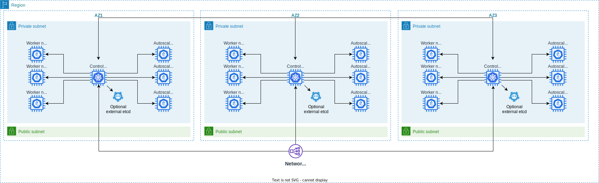

# Introduction

This project contains everthing to create an single plane or HA autoscaling kubernetes cluster on AWS cloud. The build process use **kubeadm**.

It's an EKS or Kops alternative.

The cluster support also autoscaling by using [kubernetes-aws-autoscaler](https://github.com/Fred78290/kubernetes-aws-autoscaler) and [grpc autoscaler](https://github.com/Fred78290/autoscaler)

If you allow the cluster to be visible on internet, the process will use GODADDY or Route53 to register public FCQN.

Route53 public zone and private zone could be also used or both depending the name of your public domain name or private domaine name

The process install also following kubernetes components

- cert manager
- external dns
- aws efs csi driver
- aws ebs csi driver
- kubernetes dashboard and metrics scraper
- nginx ingress controller

# Example of kubernetes cluster created with this tool

## Mono AZ single plane exposed on internet

<p align="center">

<br>

</p>

## Multi AZ HA Cluster exposed on internet

<p align="center">

<br>

<br>

<br>

</p>

## Create the masterkube

### Prerequistes

Ensure that you have sudo right

You must also install the following tools

|Linux|MacOS|
| --- | --- |
|kubectl|kubectl|
|aws cli|aws cli|
|jq|jq|
||gnu-getopt|
||gsed|
||gbase64|

First step is to fill a file named **aws.defs** in the bin directory with the values needed

```
# AWS account identity
export AWS_PROFILE=
export AWS_REGION=

# AWS keys if no profile defined
export AWS_ACCESSKEY=
export AWS_SECRETKEY=
export AWS_TOKEN=

# Route53 private ZoneID
export AWS_ROUTE53_ZONE_ID=

# AWS Route53 account if different
export AWS_PROFILE_ROUTE53=

# AWS keys if no route53 profile defined
export AWS_ROUTE53_ACCESSKEY=
export AWS_ROUTE53_SECRETKEY=
export AWS_ROUTE53_TOKEN=

# Public and private domain name
export PRIVATE_DOMAIN_NAME=
export PUBLIC_DOMAIN_NAME=

# EC2 IAM Profile, will be created with essential rights if not defined
export MASTER_INSTANCE_PROFILE_ARN=
export WORKER_INSTANCE_PROFILE_ARN=

# VPC & Subnet to use
export VPC_PUBLIC_SUBNET_ID=
export VPC_PUBLIC_SECURITY_GROUPID=
export VPC_PRIVATE_SUBNET_ID=
export VPC_PRIVATE_SECURITY_GROUPID=

# GODADDY account
export GODADDY_API_KEY=
export GODADDY_API_SECRET=
```

The simply way to create the masterkube is to run [create-masterkube.sh](create-masterkube.sh)

Some needed file are located in:

| Name | Description |
| --- | --- |
| `bin` | Essentials scripts to build the master kubernetes node  |
| `etc/ssl`  | Your CERT for https. Autosigned will be generated if empty  |
| `template`  | Templates files to deploy pod & service |

The first thing done by this script is to create a VM Template Ubuntu-20.04.3 image with kubernetes preinstalled with a container runtime.

The VM template will be named by convention focal-k8s-cni-(aws|flannel|calico|...)-(kubernetes version))-(amd64|arm64)-(docker|containerd|cri-o))

Next step will be to launch a cloned VM and create a master node. It will also deploy a dashboard at the URL https://masterkube-aws-dashboard.@your-domain@/

To connect to the dashboard, copy paste the token from file [cluster/aws-ca-k8s/dashboard-token](./cluster/aws-ca-k8s/dashboard-token)

Next step is to deploy a replicaset helloworld. This replicaset use hostnetwork:true to enforce one pod per node.

During the process the script will create many files located in

| Name | Description |
| --- | --- |
| `cluster` | Essentials file to connect to kubernetes with kubeadm join  |
| `config`  | Configuration file generated during the build process  |

## Command line arguments

| Parameter | Description | Default |
| --- | --- |--- |
| `-h\|--help` | Help  | |
| `-v\|--verbose` | Verbose mode  | |
| `-x\|--trace` | Trace execution  | |
| `-r\|--resume` | Allow to resume interrupted creation of cluster kubernetes  | |
| `--create-image-only`| Create image only and exit ||
| `--cache=<path>`| Cache location |/.local/aws/cache|
| **Flags to set some location informations** |
| `--configuration-location=<path>`| Specify where configuration will be stored  | .|
| `--ssl-location=<path>`| Specify where the etc/ssl dir is stored  | ./etc/ssl |
| `--aws-defs=<path>`| Specify the AWS defintions file  | ./bin/aws.defs|
| **Flags to set AWS informations** |
| `--profile` | AWS Profile to use | $AWS_PROFILE env vars |
| `--route53-profile` | Specify AWS profile for route53 | $AWS_PROFILE_ROUTE53 env vars |
| `--region` | AWS Region to deploy  | $AWS_REGION env vars |
| **Flag to design the kubernetes cluster** |
| `-c\|--ha-cluster` | Allow to create an HA cluster with 3 control planes | NO |
| `--worker-nodes` | Specify the number of worker node created in the cluster. | 3 |
| `--container-runtime` | Specify which OCI runtime to use. [**docker**\|**containerd**\|**cri-o**]| containerd |
| `--internet-facing` | Expose the cluster on internet port: 80 443 | public |
| `--no-internet-facing` | Don't expose the cluster on internet | public |
| `--max-pods` | Specify the max pods per created VM. | AWS set it for aws plugin else 110 |
| `--create-nginx-apigateway` | Create NGINX instance to install an apigateway. | NO |
| `--dont-create-nginx-apigateway` | Don't create NGINX instance to install an apigateway. | |
| **Flag to design the kubernetes cluster** |
| `--public-domain` | Specify the public domain to use. ||
| `--private-domain` | Specify the private domain to use. ||
| `--dashboard-hostname` | Specify the hostname for kubernetes dashboard.|masterkube-aws-dashboard|
| **Cert Manager** |
| `--cert-email=<value>` | Specify the mail for lets encrypt.||
| `--use-zerossl` | Specify cert-manager to use zerossl instead letsencrypt.|NO|
| `--zerossl-eab-kid=<value>` | Specify zerossl eab kid.||
| `--zerossl-eab-hmac-secret=<value>` | Specify zerossl eab hmac secret.||
| `--godaddy-key=<value>` | Specify godaddy api key.||
| `--godaddy-secret=<value>` | Specify godaddy api secret.||

| **Flags to expose nodes in public AZ with public IP** |
| `--control-plane-public` | Control plane are hosted in public subnet with public IP. | |
| `--no-control-plane-public` | Control plane are hosted in private subnet. | default |
| `--worker-node-public` | Worker nodes are hosted in public subnet with public IP. | |
| `--no-worker-node-public` | Worker nodes are hosted in private subnet. | default |
| **Flags in ha mode only** |
| `--create-external-etcd` | Create an external HA etcd cluster  | NO |
| `--use-nlb` | Use AWS NLB as load balancer in public AZ. | NO |
| `--dont-use-nlb` | Use NGINX as load balancer in public AZ | YES |
| **Flags in both mode** |
| `--prefer-ssh-publicip` | Allow to SSH on publicip when available|
| `--dont-prefer-ssh-publicip` | Disallow to SSH on publicip when available|YES|
| `--control-plane-machine=<value>` | Override machine type used for control plane. |t3a.medium/t4g.medium|
| `--worker-node-machine=<value>` | Override machine type used for worker nodes. |t3a.medium/t4g.medium|
| `--autoscale-machine=<value>` | Override machine type used for auto scaling. |t3a.medium/t4g.medium|
| `--nginx-machine=<value>` | The instance type name to deploy front nginx node | t3a.small/t4g.small |
| `--ssh-private-key=<value>`  | Alternate ssh key file |~/.ssh/id_rsa|
| `--transport=<value>`  | Override the transport to be used between autoscaler and vmware-autoscaler [**tcp**\|**linux**] |linux|
| `--cloud-provider=<value>`  | Set cloud provider, (aws | external | none) | external |
| `--node-group=<value>` | The name of kubernetes node group  | aws-ca-k8s |
| `--cni-plugin-version=<value>`  | CNI version |v1.1.1|
| `--cni-plugin=<value>`  | Override CNI plugin [**aws**\|**calico**\|**flannel**\|**weave**\|**romana**]|aws|
| `--kubernetes-version=<value>` | Which version of kubernetes to use |latest|
| `--volume-type=<value>` | The root volume type | gp3 |
| `--volume-size=<value>` | The root volume size in Gb | 10 |
| **Flags to configure network in aws** |
| `--public-subnet-id=<subnetid,...>` | Specify the comma separated list of public subnet ID for created VM, comma separated |
| `--public-sg-id`| Specify the public security group ID for VM|
| `--private-subnet-id=<sg-id>` | Specify the comma separated list of private subnet ID for created VM, comma separated |
| `--private-sg-id=<sg-id>` | Specify the private security group ID for VM |
| **Flags to set the template vm** |
| `--target-image=<value>` | The AMI used for EC2 instances, only if you create your own image |
| `--seed-image=<value>` | The AMI used to create the target image, region dependant |
| `--seed-user=<value>` | The cloud-init user name | ubuntu |
| `--arch=<value>`| Specify the architecture of VM (amd64\|arm64) | amd64 |
| **Flags for autoscaler** |
| `--max-nodes-total=<value>` | Maximum number of nodes in all node groups. Cluster autoscaler will not grow the cluster beyond this number. | 5 |
| `--cores-total=<value>` | Minimum and maximum number of cores in cluster, in the format < min >:< max >. Cluster autoscaler will not scale the cluster beyond these numbers. | 0:16 |
| `--memory-total=<value>` | Minimum and maximum number of gigabytes of memory in cluster, in the format < min >:< max >. Cluster autoscaler will not scale the cluster beyond these numbers. | 0:24 |
| `--max-autoprovisioned-node-group-count=<value>` | The maximum number of autoprovisioned groups in the cluster | 1 |
| `--scale-down-enabled=<value>` | Should CA scale down the cluster | true |
| `--scale-down-delay-after-add=<value>` | How long after scale up that scale down evaluation resumes | 1 minutes |
| `--scale-down-delay-after-delete=<value>` | How long after node deletion that scale down evaluation resumes, defaults to scan-interval | 1 minutes |
| `--scale-down-delay-after-failure=<value>` | How long after scale down failure that scale down evaluation resumes | 1 minutes |
| `--scale-down-unneeded-time=<value>` | How long a node should be unneeded before it is eligible for scale down | 1 minutes |
| `--scale-down-unready-time=<value>` | How long an unready node should be unneeded before it is eligible for scale down | 1 minutes |
| `--unremovable-node-recheck-timeout=<value>` | The timeout before we check again a node that couldn't be removed before | 1 minutes |

```bash
create-masterkube \
    --ha-cluster \
    --verbose \
    --worker-nodes=3
    --use-nlb \
    --internet-facing \
    --profile=awsprofile \
    --region=us-east-1 \
    --nodegroup=aws-my-k8s \
    --seed-image=ami-085925f297f89fce1 \
    --seed-user=ubuntu \
    --public-subnet-id=subnet-123,subnet-456,subnet-789 \
    --public-sg-id=sg-1234 \
    --private-subnet-id=subnet-ABC,subnet-DEF,subnet-GHI \
    --private-sg-id=sg-5678 \
    --arch=arm64 \
    --cni-plugin=calico \
    --cloud-provider=none
```

## Machine type

If you want to use another machine type rather t3a or t4g class, you must edit definition files [amd64](./templates/machines/amd64.json) [arm64](./templates/machines/arm64.json)

## Raise autoscaling

To scale up or down the cluster, just play with `kubectl scale`

To scale fresh masterkube `kubectl scale --replicas=2 deploy/helloworld -n kube-public`

## Delete master kube and worker nodes

To delete the master kube and associated worker nodes, just run the command [delete-masterkube.sh](./bin/delete-masterkube.sh)
If the create process fail for any reason, you can use flag **--force**